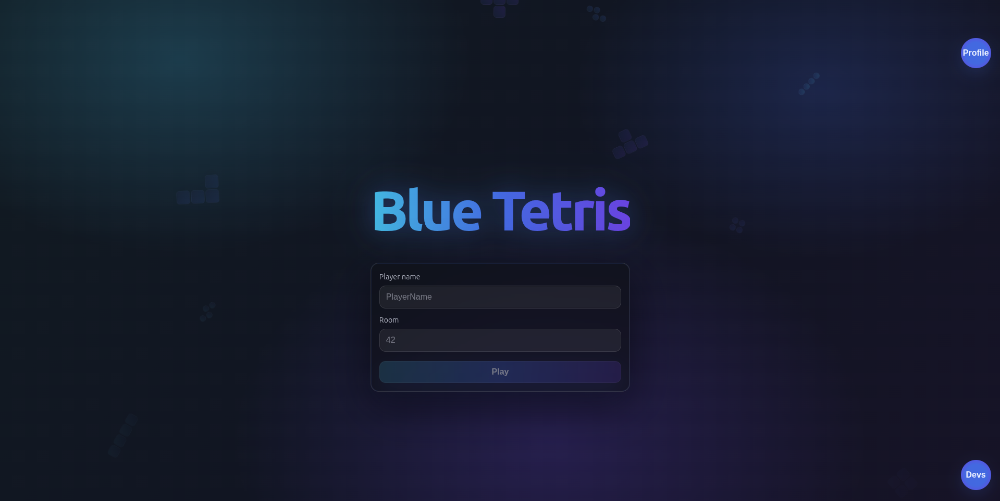
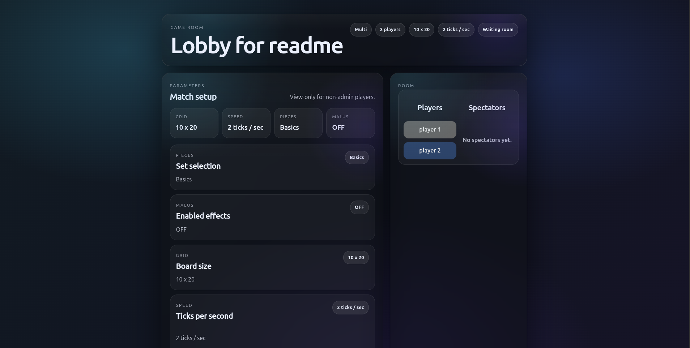
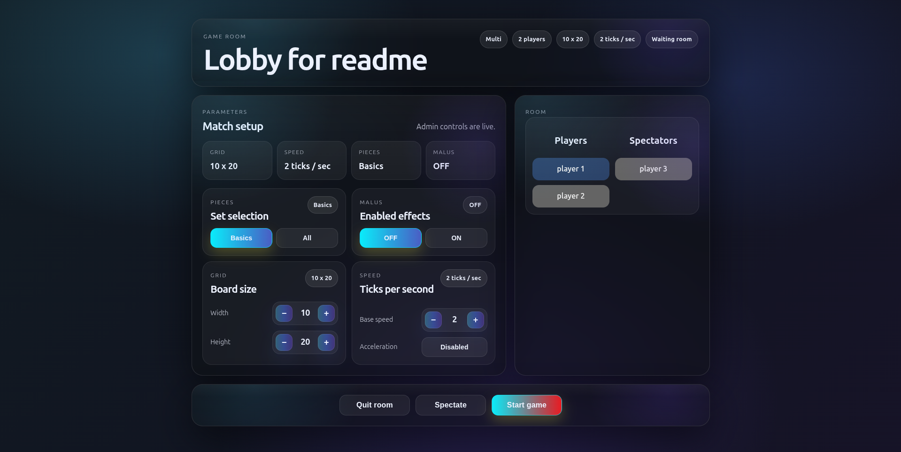
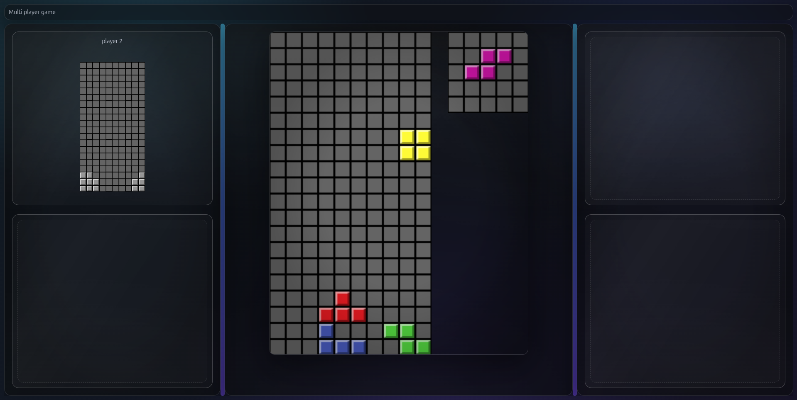
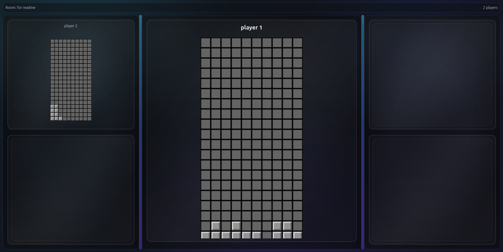

# 🕹️ Red tetris

**Plateforme web de jeu en multijoueur temps réel avec React et Node.js**

---

## 📖 Vue d'ensemble

Ce projet est une plateforme web complète permettant aux utilisateurs de jouer au célèbre jeu **Tetris**, que ce soit en solo ou en affrontant d'autres joueurs en multijoueur et en temps réel.

Le projet se distingue par une architecture moderne utilisant **React + Vite** pour le frontend, **Node.js** pour le backend, et **Socket.io** pour la gestion fluide et instantanée du multijoueur.

---

## 🖼️ Aperçus


*Page d'accueil saisie du pseudo et du salon*


*Salon d'attente affichant les joueurs présents avant le début de la partie*


*Salon d'attente admin permettant de changer les réglages de la partie*


*Partie de Tetris en multijoueur avec affichage des malus*


*Mode spectateur permettant de rejoindre une partie déjà en cours*

---

## ✨ Fonctionnalités

### 🎮 Le Jeu (Tetris)
- ✅ **Solo & Multijoueur** — Jouez seul pour vous entraîner ou affrontez d'autres joueurs en temps réel.
- ✅ **Mode Spectateur** — Rejoignez une partie en cours pour observer les autres joueurs sans intervenir.
- ✅ **Malus** — Système de malus envoyés aux adversaires pour pimenter les parties multijoueur.
- ✅ **Personnalisation** — Sélection de multiples thèmes visuels et différents modes de difficulté.
- ✅ **Pièces Customs** — Intégration de pièces personnalisées inspirées du jeu *Blokus*.

### 🌐 La Plateforme Web & Stack Technique
- 🚀 **Frontend Moderne** — Développé avec React et Vite, incluant une vérification stricte des types.
- 🔌 **Temps Réel** — Communication fluide gérée via Websockets (`socket.io`).
- 👤 **Gestion Utilisateur** — Saisie du pseudo via une modale à l'accueil et sauvegarde automatique dans les cookies.

### 🧪 Tests & Qualité
Le projet impose une couverture de tests stricte :
- **Couverture minimale** : 70% (statements, functions, lines) et 50% (branches).
- **Frontend/Backend** : Tests unitaires approfondis pour la logique du jeu, et tests d'intégration pour les endpoints de l'API.
- **Mocking** : Appels à la base de données et sous-fonctions mockés lors des tests.

## ⚙️ Intégration Continue (CI)

Le projet intègre un pipeline CI configuré avec **GitHub Actions**. Il se déclenche automatiquement lors d'un `push` ou d'une `pull_request` sur la branche `master`.

Le workflow exécute les vérifications suivantes en parallèle sur les modules `client`, `server` et `shared` :
- Configuration de l'environnement Node.js (v24).
- Installation des dépendances.
- Exécution de la suite de tests et vérification de la couverture (`npm run coverage`).

---

## 🚀 Installation & Utilisation

Le projet est divisé en deux parties principales : le client (Front) et le serveur (Back), ainsi qu'un dossier partagé.

### 🖥️ Client (Frontend)

1. Installation et build :
```bash
cd client
npm install
npm run build
```

2. Lancement en développement :
```bash
npm run dev
```

3. Lancer les tests :
```bash
npm run coverage
```

### ⚙️ Serveur (Backend)

1. Installation :
```bash
cd server
npm install
```

2. Lancement en développement :
```bash
npm run dev
```

3. Lancer les tests :
```bash
npm run coverage
```

### 🔗 Code Partagé (Shared)

Pour lancer les tests sur la logique partagée :
```bash
cd shared
npm run coverage
```

---

## 👥 Auteurs

**Auguste Deroubaix** (Agtdbx) 🔗 [GitHub](https://github.com/agtdbx) • 🎓 Étudiant 42</br>
**Lucas Mugot** (Acholias) 🔗 [GitHub](https://github.com/Acholias) • 🎓 Étudiant 42
